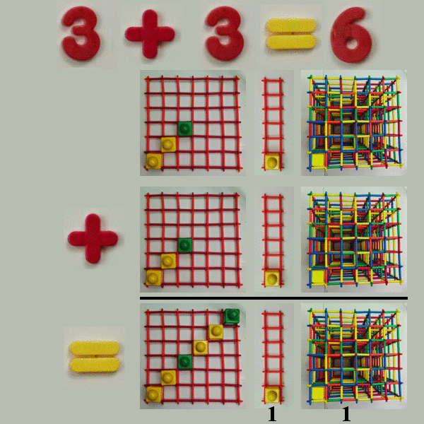

.. Simply Animate Math documentation master file, created by
   sphinx-quickstart on Mon Mar  9 11:13:35 2015.
   You can adapt this file completely to your liking, but it should at least
   contain the root `toctree` directive.

Welcome to Simply Animate Math's documentation!
===============================================

Tool to make gif animations about space-time math.  Has not been generalized, but can make an image like so:

.. toctree::
   :maxdepth: 2

simply_animate_math.py
======================
.. automodule:: simply_animate_math
    :members:

config.py
=========
.. automodule:: config
    :members:

template.py
===========
.. automodule:: template
    :members:

photos.py
=========
.. automodule:: photos
    :members:

Indices and tables
==================

* :ref:`genindex`
* :ref:`modindex`
* :ref:`search`

