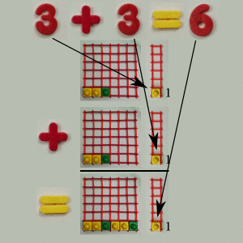

# Animated numbers

Animated numbers have two qualities:

1. How long they last
1. Where they are

Adding time makes things last longer.

<small>For technical readers concerned with calling these animated numbers
instead of complex numbers, [here are some
thoughts](../about/technical_summary.md#an_v_cn).  The simple equations used
are [also discussed](../about/technical_summary.md#equations).
