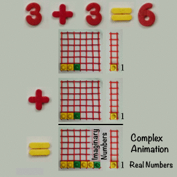

# Animated numbers as complex numbers

Complex animations have the same information as the complex plane.

Real numbers are the frame of an animation.

Complex numbers are the location in the frame.
