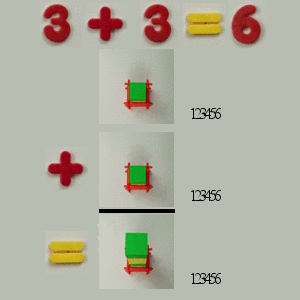

# Super Collider Math

It all happens **so fast** that all the numbers look the same.

With no difference between addition, subtraction, multiplication, and division, physicists have to take into account all possible possibilities.

This sounds hard to do because it is.

