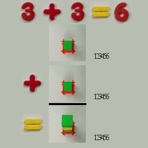

# Super Collider Math

It all happens **so fast** that all the numbers look the same.

Some might say they can see differences between these, but that was only 
because I was trying to help you :-)

With no difference between addition, subtraction, multiplication, and division, 
physicists have to take into account all possible possibilities.

This sounds hard to do because it is.

