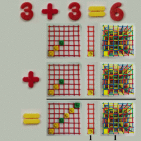
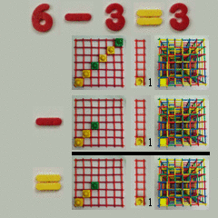
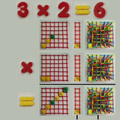
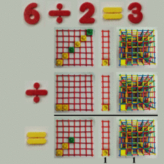

# Space-time numbers: constant motion

These animations are about three numbers: 2, 3, and 6.

There are three views:

1. A static plane
1. An animated line
1. An animated cube

Addition, subtraction, multiplication, and division work in all cases.

This must be the law (but it isn't).
