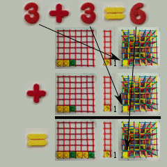

# Space-time numbers

Time remains time.

Space can now be space.

This is the domain of space-time math.

<small>Any technical people concerned with using the label **space-time numbers**
instead of **quaternions** should [see this 
page](../about/technical_summary.md#stn_v_q)</small>.
