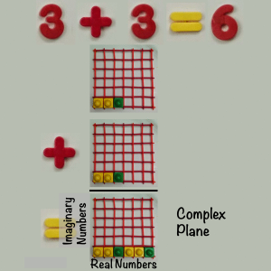

# Static numbers in a plane as complex numbers

 

The real numbers are horizontal, never surprising.

The imaginary number rotate real numbers to be like them.
OR
Real numbers let the imaginary numbers keep going along.

Real times real = real

Imaginary times imaginary = -real because imaginaries rotate imaginaries.

The pair, (real, imaginary) make up the complex plane.
