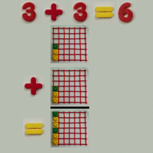

# Static numbers in a plane that are vertical

 

Addition and subtraction are simple.

For multiplication and division, the vertical numbers rotate the horizontal numbers to "be like them".

The rotation is required so that from any point in the plane, one can travel to any other point in the plane by multiplying or dividing by the right number.

With no rotation, one would be stuck to keep going the same way.
