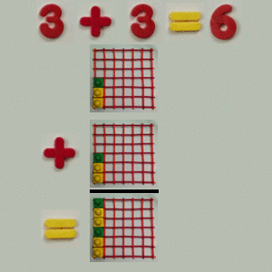

# Static Plane Math: Vertical

Addition and subtraction are simple.

For multiplication and division, the vertical numbers rotate the horizontal numbers to "be like them".

The rotation is required so that from any point in the plane, one can travel to any other point in the plane by mulitplying or dividing by the right number.
